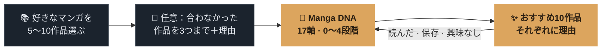
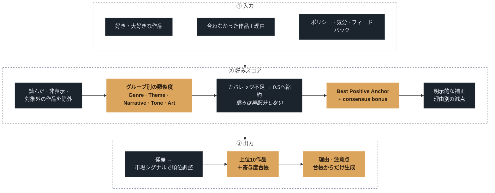
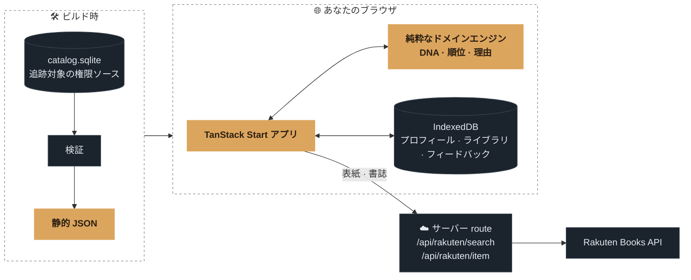

<p align="center">
  <a href="https://konocomics.vercel.app">
    
  </a>
</p>

<p align="center">
  <strong>好みを知って、次の一冊を理由とともに。</strong><br />
  好きなマンガから17軸の <em>Manga DNA</em> をつくり、おすすめの理由まで示すローカルファーストの Web アプリです。
</p>

<p align="center">
  <a href="https://konocomics.vercel.app"></a>
</p>

<p align="center">
  
  
  
  
  
  
</p>

<p align="center">
  <a href="./README.md">English</a> · <a href="./README.ko.md">한국어</a> · <strong>日本語</strong>
  <br />
  <a href="#仕組み">仕組み</a> ·
  <a href="#おすすめエンジン">エンジン</a> ·
  <a href="#アーキテクチャ">アーキテクチャ</a> ·
  <a href="#ローカルで動かす">ローカルで動かす</a>
</p>

<br />

<p align="center">
  
</p>

> [!NOTE]
> <strong>kono</strong> + <strong>mi</strong> = このみ（好み）。名前の中にプロダクトのテーマが隠れています。

## konocomics ならではの特徴

<table>
  <tr>
    <td width="33%" valign="top">
      <h3>🧬 ジャンルの先まで見る</h3>
      Manga DNA は物語、テンポ、関係性、雰囲気、心の負担を<strong>17の観察軸</strong>で読み取ります。表示は点数ではなく段階だけです。
    </td>
    <td width="33%" valign="top">
      <h3>🔎 根拠までたどれる理由</h3>
      おすすめの文章はすべて、スコアエンジンが返すファクター寄与度からだけつくります。実行時の LLM が順位を決めたり理由を書いたりはしません。
    </td>
    <td width="33%" valign="top">
      <h3>🔒 はじめからローカル</h3>
      プロフィール、読書記録、フィードバック、設定はブラウザの <strong>IndexedDB</strong> にだけ保存します。アカウントもサーバー側のDBもありません。
    </td>
  </tr>
</table>

## 仕組み



<table>
  <tr>
    <td width="33%" align="center"></td>
    <td width="33%" align="center"></td>
    <td width="33%" align="center"></td>
  </tr>
  <tr>
    <td valign="top"><strong>1 · 選ぶ</strong><br />検索するか棚から選びます。☆で「大好き」にすると、より強く反映されます。</td>
    <td valign="top"><strong>2 · DNA を読む</strong><br />強く表れた好み、その根拠になった作品、各ファクターが順位にどう効くかを確かめます。</td>
    <td valign="top"><strong>3 · 探す</strong><br />理由を開き、気分やジャンルで絞り込み、ライブラリに保存するか、合わなかった点をエンジンに伝えます。</td>
  </tr>
</table>

<details>
<summary><strong>DNA をリンクで共有する</strong></summary>
<br />


共有ページは完全に静的です。DNA の段階、選んだ作品、おすすめ作品は URL クエリに入り、サーバーには何も保存しません。
</details>

## おすすめエンジン

順位のルールは、隠れたヒューリスティックではなく明示したプロダクト契約です。[製品仕様 §6](./docs/planning/02-product-spec.md) が唯一の正です。



- **不明は苦手ではありません。** `unknown` のファクターを苦手として計算しません。カバレッジの低いグループだけを中立値 `0.5` へ縮約し、余った重みをほかのグループへ再配分しません。
- **複数の好みを分けて保ちます。** Best Positive Anchor により、好きな作品すべてを一つの平均ベクトルへ押し込みません。
- **好みが順位を決めます。** 固定したファクターグループの重みで適合度を求め、市場シグナルは近いスコアの順位調整にだけ使います。
- **理由は根拠からだけつくります。** 説明と注意点は、選ばれた作品の寄与度台帳と根拠作品だけから組み立てます。
- **同じ入力には同じ結果を返します。** ドメイン層は純粋かつ決定論的で、時刻、乱数、I/O、実行時のモデル呼び出しを使いません。

### ファクター語彙

| グループ               | 数  | 例                                                         |
| ---------------------- | :-: | ---------------------------------------------------------- |
| Genre                  | 10  | アクション、ファンタジー、ミステリー、恋愛 …               |
| Theme / Mechanic       | 22  | 捜査・調査、疑似家族、サバイバル …                         |
| Narrative 軸           |  6  | 成長・報酬、戦略、テンポ、謎解き・伏線、世界観 …           |
| Tone / Relationship 軸 |  7  | 人物の変化、コメディ、ダークさ、精神的な重さ、あたたかさ … |
| Art 軸                 |  4  | リアル寄り、描き込み、やわらかさ、迫力・スピード感         |

各値は `known`、`unknown`、`notApplicable` を区別します。定義は[ファクター辞書](./docs/factors/factor-dictionary.md)にあります。

## アーキテクチャ



- 追跡対象の SQLite Catalog は**ビルド時の権限ソース**で、ユーザーデータを置く実行時DBではありません。
- 個人データはすべてブラウザが持ちます。
- サーバーコードは Rakuten Books のレスポンス（表紙・書誌）を検証して縮小する2本の route だけで、認証情報はサーバー内に保ちます。

現在生成される Catalog は **3,309作品**です。おすすめ対象が **2,495作品**、Library 専用が **814作品**です。適格性を分けることで、Library にあるだけの作品が検証なしに好みの分析へ入ることを防ぎます。

<details>
<summary><strong>主な契約文書</strong></summary>

- [製品仕様](./docs/planning/02-product-spec.md)
- [ファクター辞書](./docs/factors/factor-dictionary.md)
- [アーキテクチャ](./docs/planning/05-architecture.md)
- [Catalog authoring の権限](./docs/planning/09-catalog-authoring-authority.md)
- [UX画面契約](./docs/planning/03-ux-screen-contracts.md)

</details>

## ローカルで動かす

**Node.js 24** と **pnpm 10** が必要です。

```bash
pnpm install
pnpm dev
```

同梱 Catalog、Manga DNA、おすすめ、ローカル Library は、リモートDBなしで動きます。Rakuten の検索・作品取得・表紙画像を有効にするには、`.env.example` を `.env.local` へコピーし、サーバー専用の値を設定してください。

<details>
<summary><strong>品質ゲート</strong></summary>

```bash
pnpm typecheck
pnpm lint
pnpm test
pnpm test:e2e
pnpm build
pnpm catalog:authority:verify
pnpm catalog:validate
```

</details>

## 技術スタック

TanStack Start · TanStack Router · React 19 · TypeScript · Tailwind CSS 4 · Base UI · Motion · Dexie · Zod · Fuse.js · Vitest · Playwright

<br />

<p align="center">
  <sub>表紙画像と書誌情報は<a href="https://books.rakuten.co.jp/">楽天ブックス</a> API から提供されています。</sub>
</p>
