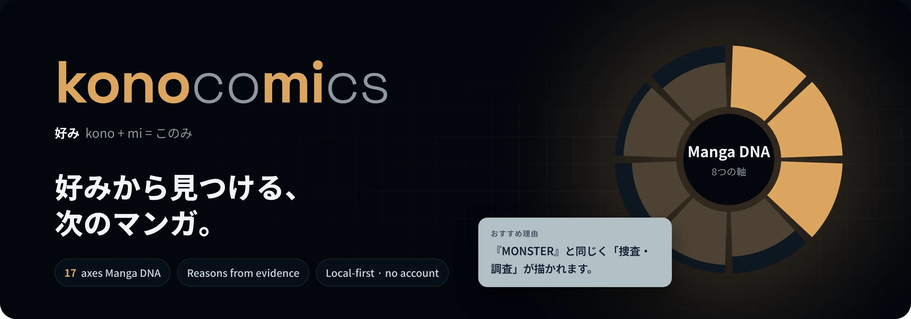
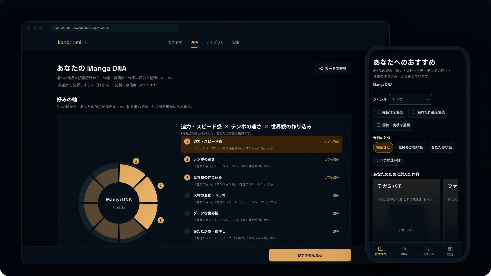
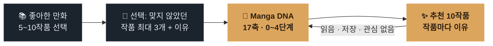
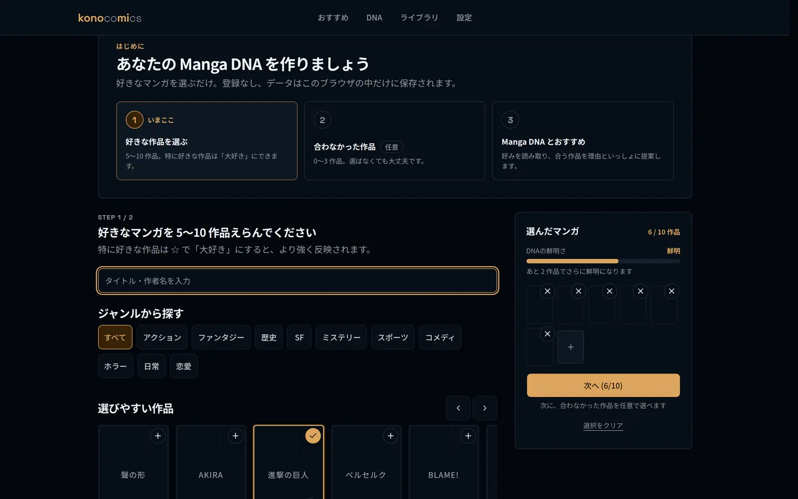
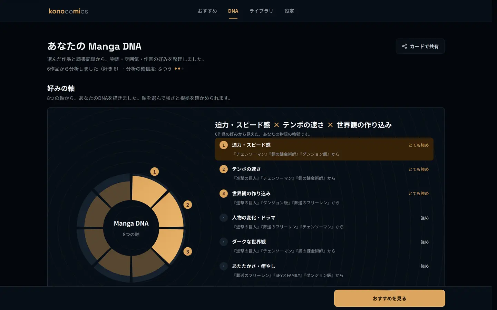
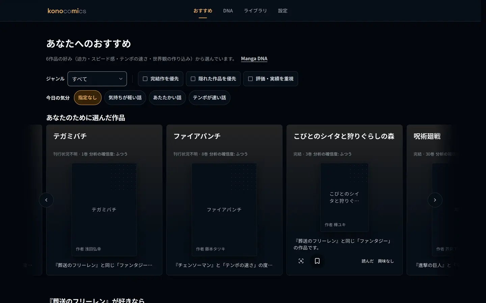
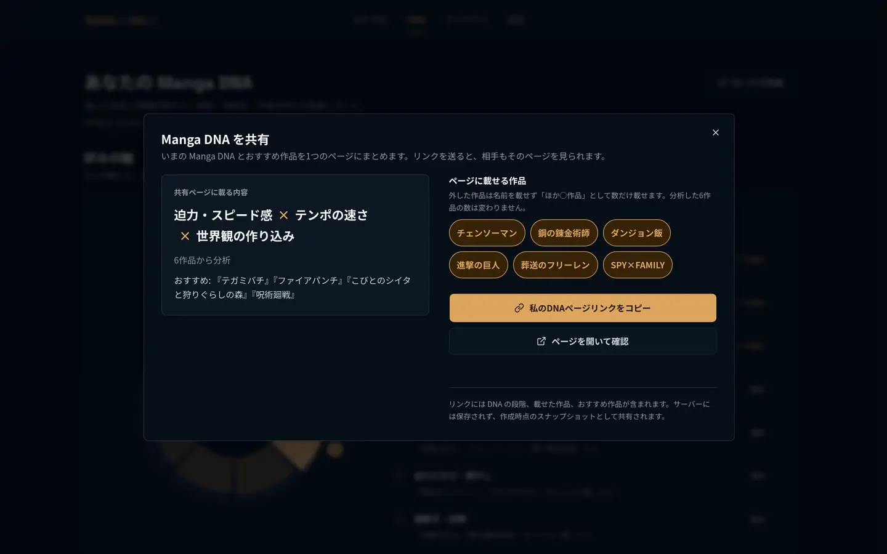
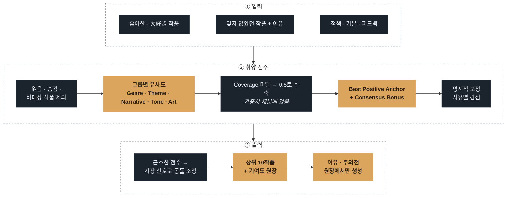
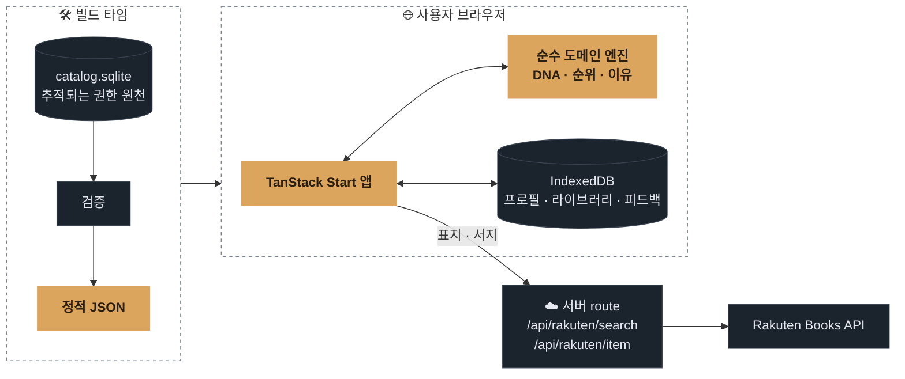

<p align="center">
  <a href="https://konocomics.vercel.app">
    
  </a>
</p>

<p align="center">
  <strong>만화 취향을 알고, 다음 작품을 이유와 함께 찾으세요.</strong><br />
  좋아한 만화에서 17축 <em>Manga DNA</em>를 만들고 추천 이유까지 보여 주는 로컬 우선 웹앱입니다.
</p>

<p align="center">
  <a href="https://konocomics.vercel.app"></a>
</p>

<p align="center">
  
  
  
  
  
  
</p>

<p align="center">
  <a href="./README.md">English</a> · <strong>한국어</strong> · <a href="./README.ja.md">日本語</a>
  <br />
  <a href="#작동-방식">작동 방식</a> ·
  <a href="#추천-엔진">추천 엔진</a> ·
  <a href="#아키텍처">아키텍처</a> ·
  <a href="#로컬에서-실행하기">로컬 실행</a>
</p>

<br />

<p align="center">
  
</p>

> [!NOTE]
> 제품 UI는 일본어입니다. <strong>kono</strong> + <strong>mi</strong> = konomi(好み, 취향). 이름 안에 제품의 주제가 숨어 있습니다.

## konocomics가 다른 점

<table>
  <tr>
    <td width="33%" valign="top">
      <h3>🧬 장르보다 세밀한 취향</h3>
      Manga DNA는 서사, 전개 속도, 관계, 분위기, 심리적 피로도를 <strong>17개 관찰 축</strong>으로 읽습니다. 점수가 아니라 단계로만 보여 줍니다.
    </td>
    <td width="33%" valign="top">
      <h3>🔎 근거까지 추적되는 이유</h3>
      모든 추천 문장은 점수 엔진이 반환한 팩터 기여도에서만 만듭니다. 런타임 LLM이 순위를 정하거나 이유를 쓰지 않습니다.
    </td>
    <td width="33%" valign="top">
      <h3>🔒 기본값부터 로컬</h3>
      프로필, 독서 기록, 피드백, 설정은 브라우저의 <strong>IndexedDB</strong>에만 저장됩니다. 계정도 서버 측 제품 DB도 없습니다.
    </td>
  </tr>
</table>

## 작동 방식



<table>
  <tr>
    <td width="33%" align="center"></td>
    <td width="33%" align="center"></td>
    <td width="33%" align="center"></td>
  </tr>
  <tr>
    <td valign="top"><strong>1 · 고르기</strong><br />Catalog를 검색하거나 책장에서 고릅니다. ☆로 「大好き」를 표시하면 더 강하게 반영됩니다.</td>
    <td valign="top"><strong>2 · DNA 읽기</strong><br />강한 취향, 그 판단을 뒷받침한 작품, 각 팩터가 순위에 미치는 영향을 확인합니다.</td>
    <td valign="top"><strong>3 · 탐색하기</strong><br />추천 이유를 열고, 기분·장르로 좁히고, 라이브러리에 저장하거나 맞지 않은 이유를 엔진에 알려 줍니다.</td>
  </tr>
</table>

<details>
<summary><strong>DNA를 링크로 공유하기</strong></summary>
<br />


공유 페이지는 완전히 정적입니다. DNA 단계, 고른 작품, 추천 작품이 URL 쿼리에 담기며 서버에는 아무것도 저장하지 않습니다.
</details>

## 추천 엔진

순위 규칙은 숨은 휴리스틱이 아니라 명시적인 제품 계약입니다. [제품 사양 §6](./docs/planning/02-product-spec.md)이 단일 진실 원천입니다.



- **데이터 없음은 불호가 아닙니다.** `unknown` 팩터를 부정 취향으로 계산하지 않습니다. Coverage가 낮은 그룹만 중립값 `0.5`로 수축하고, 남은 그룹에 가중치를 재분배하지 않습니다.
- **여러 취향을 분리해 보존합니다.** Best Positive Anchor 방식으로 좋아한 작품 전체를 하나의 평균 벡터로 뭉개지 않습니다.
- **취향이 순위를 주도합니다.** 고정된 팩터 그룹 가중치가 취향 적합도를 결정하며, 시장 신호는 가까운 점수의 동률 조정에만 씁니다.
- **이유는 근거에서만 생성합니다.** 설명과 주의점은 선택된 작품의 기여도 원장과 근거 작품에서만 만듭니다.
- **같은 입력에는 같은 결과를 냅니다.** 도메인 계층은 순수하고 결정론적입니다. 시간, 난수, I/O, 런타임 모델 호출을 사용하지 않습니다.

### 팩터 어휘

| 그룹                   | 수  | 예시                                             |
| ---------------------- | :-: | ------------------------------------------------ |
| Genre                  | 10  | 액션, 판타지, 미스터리, 연애 …                   |
| Theme / Mechanic       | 22  | 수사, 유사 가족, 서바이벌 …                      |
| Narrative 축           |  6  | 성장, 전략, 전개 속도, 수수께끼·복선, 세계관 …   |
| Tone / Relationship 축 |  7  | 인물의 변화, 개그, 어두움, 심리적 무게, 따뜻함 … |
| Art 축                 |  4  | 사실성, 묘사 밀도, 부드러움, 박력·속도감         |

각 값은 `known`, `unknown`, `notApplicable` 상태를 구분합니다. 정의는 [팩터 사전](./docs/factors/factor-dictionary.md)에 있습니다.

## 아키텍처



- 추적되는 SQLite Catalog는 **빌드 타임 권한 원천**이며 사용자 데이터를 보관하는 런타임 DB가 아닙니다.
- 개인 데이터는 모두 브라우저가 소유합니다.
- 서버 코드는 Rakuten Books 응답(표지·서지)을 검증하고 축소하는 두 route뿐이며, 자격 증명은 서버에만 둡니다.

현재 생성된 Catalog에는 **3,309작품**이 있습니다. **2,495작품**은 추천 대상이고 **814작품**은 Library 전용입니다. 적격 상태를 분리했기 때문에 Library에 있는 작품이 검증 없이 취향 분석에 섞이지 않습니다.

<details>
<summary><strong>주요 계약 문서</strong></summary>

- [제품 사양](./docs/planning/02-product-spec.md)
- [팩터 사전](./docs/factors/factor-dictionary.md)
- [아키텍처](./docs/planning/05-architecture.md)
- [Catalog authoring 권한](./docs/planning/09-catalog-authoring-authority.md)
- [UX 화면 계약](./docs/planning/03-ux-screen-contracts.md)

</details>

## 로컬에서 실행하기

**Node.js 24**와 **pnpm 10**이 필요합니다.

```bash
pnpm install
pnpm dev
```

번들 Catalog, Manga DNA, 추천, 로컬 Library는 원격 DB 없이 작동합니다. Rakuten 검색·작품 조회·표지 이미지를 사용하려면 `.env.example`을 `.env.local`로 복사하고 서버 전용 값을 설정하세요.

<details>
<summary><strong>품질 게이트</strong></summary>

```bash
pnpm typecheck
pnpm lint
pnpm test
pnpm test:e2e
pnpm build
pnpm catalog:authority:verify
pnpm catalog:validate
```

</details>

## 기술 스택

TanStack Start · TanStack Router · React 19 · TypeScript · Tailwind CSS 4 · Base UI · Motion · Dexie · Zod · Fuse.js · Vitest · Playwright

<br />

<p align="center">
  <sub>표지 이미지와 서지 정보는 <a href="https://books.rakuten.co.jp/">楽天ブックス</a> API에서 제공받습니다.</sub>
</p>
