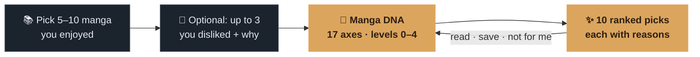
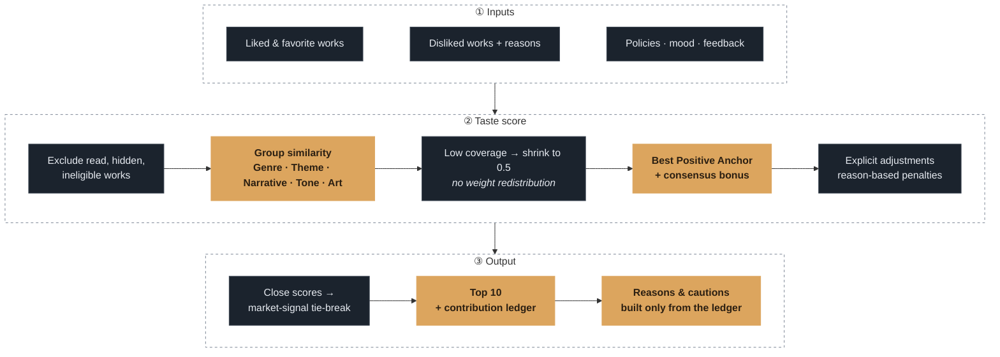
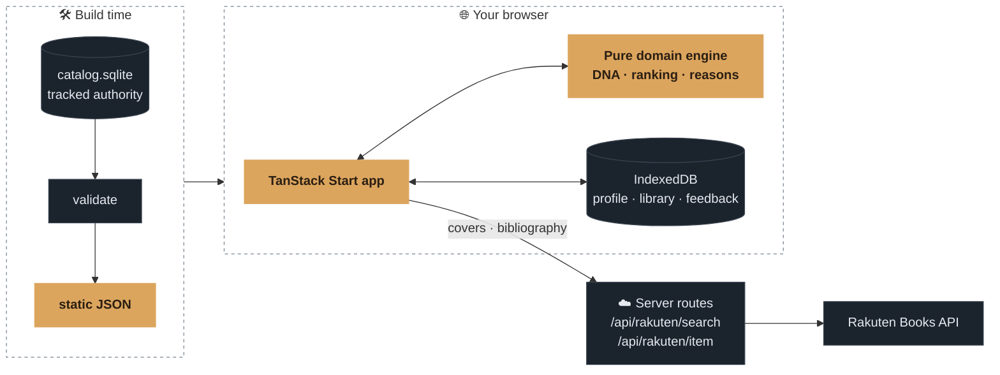

<p align="center">
  <a href="https://konocomics.vercel.app">
    
  </a>
</p>

<p align="center">
  <strong>Know your manga taste. Find your next read — with reasons.</strong><br />
  A local-first web app that turns the manga you liked into a 17-axis <em>Manga DNA</em> and explainable recommendations.
</p>

<p align="center">
  <a href="https://konocomics.vercel.app"></a>
</p>

<p align="center">
  
  
  
  
  
  
</p>

<p align="center">
  <strong>English</strong> · <a href="./README.ko.md">한국어</a> · <a href="./README.ja.md">日本語</a>
  <br />
  <a href="#how-it-works">How it works</a> ·
  <a href="#the-recommendation-engine">Engine</a> ·
  <a href="#architecture">Architecture</a> ·
  <a href="#run-locally">Run locally</a>
</p>

<br />

<p align="center">
  
</p>

> [!NOTE]
> The interface is Japanese. <strong>kono</strong> + <strong>mi</strong> = konomi (好み, “taste”) — the product is hidden in the name.

## Why konocomics

<table>
  <tr>
    <td width="33%" valign="top">
      <h3>🧬 Taste beyond genre</h3>
      Manga DNA reads narrative, pace, relationships, tone, and mental load across <strong>17 observable axes</strong> — shown as qualitative levels, never as scores.
    </td>
    <td width="33%" valign="top">
      <h3>🔎 Reasons with provenance</h3>
      Every recommendation sentence comes from the scoring engine's factor contributions. No runtime LLM picks the rank or writes the reason.
    </td>
    <td width="33%" valign="top">
      <h3>🔒 Local by default</h3>
      Profiles, reading records, feedback, and settings stay in your browser's <strong>IndexedDB</strong>. No account, no server-side product database.
    </td>
  </tr>
</table>

## How it works



<table>
  <tr>
    <td width="33%" align="center"></td>
    <td width="33%" align="center"></td>
    <td width="33%" align="center"></td>
  </tr>
  <tr>
    <td valign="top"><strong>1 · Choose</strong><br />Search the catalog or pick from the shelf. Mark favorites with ☆ to weigh them more.</td>
    <td valign="top"><strong>2 · Read your DNA</strong><br />See your strongest factors, the works that support each one, and how they shape the ranking.</td>
    <td valign="top"><strong>3 · Explore</strong><br />Open the reasons, filter by mood or genre, save to your library, or tell the engine what didn't fit.</td>
  </tr>
</table>

<details>
<summary><strong>Share your DNA as a link</strong></summary>
<br />


The share page is fully static: the DNA levels, chosen works, and picks live in the URL query. Nothing is stored on a server.
</details>

## The recommendation engine

The ranking rules are product contracts, not hidden heuristics. The [product specification §6](./docs/planning/02-product-spec.md) is the single source of truth.



- **Unknown is not dislike.** An unknown factor never becomes a negative preference. Low-coverage groups contract toward neutral `0.5`; their weight is not reassigned elsewhere.
- **Multiple tastes stay distinct.** Best Positive Anchor matching avoids flattening every liked work into one average vector.
- **Taste leads the rank.** Fixed factor-group weights decide taste fit. Market signals only break close ties.
- **Reasons come from evidence.** Explanations are built only from the selected work's contribution ledger and supporting anchors.
- **Same input, same result.** The domain layer is pure and deterministic: no clock, randomness, I/O, or runtime model call.

### The factor vocabulary

| Group                    | Count | Examples                                                        |
| ------------------------ | :---: | --------------------------------------------------------------- |
| Genre                    |  10   | action, fantasy, mystery, romance …                             |
| Theme / mechanic         |  22   | investigation, found family, survival …                         |
| Narrative axes           |   6   | progression, strategy, pacing, mystery reveal, world-building … |
| Tone / relationship axes |   7   | character arc, comedy, darkness, mental stress, warmth …        |
| Art axes                 |   4   | realism, density, softness, motion impact                       |

Every factor has a _known_, _unknown_, or _not-applicable_ state. Definitions live in the [factor dictionary](./docs/factors/factor-dictionary.md).

## Architecture



- The tracked SQLite catalog is a **build-time authority**, not a runtime user database.
- The browser owns all personal state.
- The only server code is two routes that validate and reduce Rakuten Books responses (covers and bibliographic data) while keeping credentials server-side.

The generated catalog currently holds **3,309 works**: **2,495 recommendation-eligible** and **814 library-only**. Eligibility is explicit, so a work can live in your library without silently entering taste analysis.

<details>
<summary><strong>Key contracts</strong></summary>

- [Product specification](./docs/planning/02-product-spec.md)
- [Factor dictionary](./docs/factors/factor-dictionary.md)
- [Architecture](./docs/planning/05-architecture.md)
- [Catalog authoring authority](./docs/planning/09-catalog-authoring-authority.md)
- [UX screen contracts](./docs/planning/03-ux-screen-contracts.md)

</details>

## Run locally

Requires **Node.js 24** and **pnpm 10**.

```bash
pnpm install
pnpm dev
```

The bundled catalog, Manga DNA, recommendations, and local library work without a remote database. To enable Rakuten-backed search, item lookup, and cover images, copy `.env.example` to `.env.local` and fill in the server-only values.

<details>
<summary><strong>Quality gates</strong></summary>

```bash
pnpm typecheck
pnpm lint
pnpm test
pnpm test:e2e
pnpm build
pnpm catalog:authority:verify
pnpm catalog:validate
```

</details>

<details>
<summary><strong>Catalog 작업 이어가기</strong></summary>

수집·판정 작업의 [저장·이관 계약](./docs/catalog-expansion/03-local-authoring-storage.md#다른-환경으로-코드와-작업-db-이전)을 따른다. Git은 실행 코드와 정식 Catalog를 전달하며, 진행 중인 원문·판정·checkpoint가 든 작업 DB는 별도로 전달한다. 공개 저장소에 작업 DB를 추가하지 않는다.

Linux/WSL에서는 Node.js 24, pnpm 10, Python 3.12+와 gcc를 준비한 뒤 저장소 루트에서 실행한다. 시스템 Python이나 SQLite를 교체하지 않고 전용 SQLite 3.53.4 runtime을 설치한다.

```bash
git pull --ff-only
pnpm install --frozen-lockfile
python3 scripts/setup_catalog_runtime.py
python3 scripts/catalog_python.py -c 'import sqlite3; print(sqlite3.sqlite_version)'
```

Windows에서는 위 Python 명령의 `python3`를 `python`으로 바꾼다. 다른 OS의 runtime 디렉터리를 복사해 실행하지 않는다. 작업 DB를 이전할 때는 인계 manifest의 commit·DB SHA·generation을 확인하고 기존 DB를 덮어쓰지 않는다. 복구는 작업자를 자동 재개하지 않으며 실제 대상·원본 경로 mapping·단계 백업 확인 뒤 기존 명령으로 이어간다.
</details>

## Stack

TanStack Start · TanStack Router · React 19 · TypeScript · Tailwind CSS 4 · Base UI · Motion · Dexie · Zod · Fuse.js · Vitest · Playwright

<br />

<p align="center">
  <sub>Cover images and bibliographic data are provided by the <a href="https://books.rakuten.co.jp/">Rakuten Books</a> API.</sub>
</p>
